# Design Document: Sous Chef PWA

## Overview

Sous Chef PWA is a Progressive Web Application built with React and TypeScript that provides the user interface for the Sous Chef recipe management system. The app uses a mobile-first responsive design with three primary navigation flows (Plan, Shop, Cook) while ensuring core recipe capabilities are accessible from anywhere.

The architecture prioritizes:
- **Offline-first**: All data stored locally via sql.js (SQLite in WebAssembly)
- **Performance**: Lazy loading, virtualized lists, optimistic updates
- **Accessibility**: WCAG AA compliance, keyboard navigation, screen reader support
- **Flexibility**: Features available contextually, not locked to specific flows

## Architecture

```mermaid
graph TB
    subgraph PWA["Progressive Web App"]
        SW[Service Worker]
        AppShell[App Shell]
    end
    
    subgraph UI["UI Layer (React)"]
        Nav[Navigation Shell]
        PlanView[Planning View]
        ShopView[Shopping View]
        CookView[Cooking View]
        RecipeDetail[Recipe Detail]
        CookMode[Cook Mode]
    end
    
    subgraph Components["Shared Components"]
        RecipeCard[Recipe Card]
        QuickActions[Quick Actions]
        ScaleControl[Scale Control]
        UnitToggle[Unit Toggle]
        PhotoGallery[Photo Gallery]
        RatingControl[Rating Control]
    end
    
    subgraph State["State Management"]
        Store[Zustand Store]
        Cache[React Query Cache]
    end
    
    subgraph Services["Service Layer (Existing)"]
        RecipeService[Recipe Service]
        MenuService[Menu Service]
        ShoppingService[Shopping Service]
        StatsService[Statistics Service]
        AIService[AI Service]
    end
    
    subgraph Data["Data Layer"]
        SQLJS[(sql.js / SQLite)]
        IndexedDB[(IndexedDB)]
        LocalStorage[Local Storage]
    end
    
    SW --> AppShell
    AppShell --> UI
    UI --> Components
    UI --> State
    State --> Services
    Services --> Data
    Components --> State
```



### Technology Stack

| Layer | Technology | Rationale |
|-------|------------|-----------|
| Framework | React 18 | Component model, hooks, concurrent features |
| Language | TypeScript | Type safety, IDE support, existing codebase |
| Styling | Tailwind CSS | Mobile-first utilities, small bundle |
| State | Zustand + React Query | Simple global state + server state caching |
| Routing | React Router v6 | Standard, supports lazy loading |
| Database | sql.js | SQLite in WASM, compatible with existing schema |
| PWA | Workbox | Service worker tooling, caching strategies |
| Testing | Vitest + Testing Library | Fast, compatible with existing tests |

### Key Architectural Decisions

1. **sql.js for SQLite**: The existing backend uses SQLite. sql.js compiles SQLite to WebAssembly, allowing the same SQL queries to run in the browser. The database file is persisted to IndexedDB.

2. **Service Layer Reuse**: The existing TypeScript services (RecipeService, MenuService, etc.) are reused with minimal adaptation. The main change is swapping better-sqlite3 for sql.js.

3. **Zustand for UI State**: Lightweight state management for UI concerns (current view, modals, toasts). React Query handles data fetching/caching.

4. **Component-First Design**: Core recipe capabilities (scaling, units, photos, ratings) are implemented as reusable components that appear in multiple views.


## Components and Interfaces

The UI is organized into three layers:
1. **Foundation** - App shell, navigation, shared infrastructure
2. **Core Recipe Components** - Reusable across all flows
3. **Flow-Specific Views** - Plan, Shop, Cook entry points

---

### Foundation Components

#### App Shell

```typescript
interface AppShellProps {
  children: React.ReactNode;
}

// The root component that provides:
// - Service worker registration
// - Navigation shell (Plan | Shop | Cook)
// - Global search overlay
// - Toast notifications
// - Modal container
// - Offline indicator
```

#### Navigation Shell

```typescript
interface NavigationItem {
  id: 'plan' | 'shop' | 'cook';
  label: string;
  icon: React.ComponentType;
  path: string;
}

interface NavigationShellProps {
  activeItem: NavigationItem['id'];
  onNavigate: (item: NavigationItem['id']) => void;
}

// Three primary tabs representing the cooking week stages:
// - Plan: "What should we eat?" - menu building, discovery
// - Shop: "What do we need?" - shopping list management
// - Cook: "Let's make it!" - recipe execution, logging
//
// Renders as:
// - Bottom bar on mobile (< 768px)
// - Collapsible sidebar on desktop (≥ 768px)
// - Always includes global search and settings access
```

---

### Core Recipe Components

These components appear throughout the app - in any flow, any view. They represent the "always available" recipe capabilities.

#### Recipe Card

```typescript
interface RecipeCardProps {
  recipe: Recipe;
  variant: 'compact' | 'standard' | 'detailed';
  showQuickActions?: boolean;
  onTap?: () => void;
  onQuickAction?: (action: QuickActionType) => void;
}

type QuickActionType = 
  | 'cook-now'
  | 'add-to-menu'
  | 'scale'
  | 'share'
  | 'edit'
  | 'duplicate'
  | 'delete';

// The universal recipe display unit. Appears in:
// - Planning: recommendations, brainstorm results, menu slots
// - Shopping: recipe links on ingredients
// - Cooking: today's menu, recent recipes, search results
//
// Always displays: photo, title, rating, time
// Quick actions accessible via long-press or menu icon
```

#### Recipe Detail

```typescript
interface RecipeDetailProps {
  recipeId: string;
  initialScale?: number;
  initialUnitSystem?: UnitSystem;
}

// Full recipe view with ALL core capabilities:
// - Display: title, photo gallery, description, times, servings, rating, tags
// - Scaling: adjust servings, all quantities update
// - Units: toggle US/metric
// - Ingredients: list with check-off, substitution indicators
// - Instructions: numbered steps
// - Photos: gallery organized by cook session
// - History: version timeline, restore capability
// - Heritage: parent/child links for duplicates
// - Statistics: times cooked, average times
// - Quick Actions: Cook Now, Add to Menu, Edit, Share, Duplicate, Delete
```

#### Scale Control

```typescript
interface ScaleControlProps {
  baseServings: number;
  currentServings: number;
  onChange: (servings: number) => void;
}

// Available on Recipe Detail and before starting Cook Mode
// Stepper with +/- buttons, direct input, shows scale factor
```

#### Unit Toggle

```typescript
interface UnitToggleProps {
  currentSystem: UnitSystem;
  onChange: (system: UnitSystem) => void;
}

// Segmented control: US | Metric
// Available on Recipe Detail, persists to user preferences
```

#### Quick Actions Menu

```typescript
interface QuickActionsProps {
  recipe: Recipe;
  onAction: (action: QuickActionType) => void;
}

// Consistent across ALL views where recipes appear
// Dropdown (desktop), bottom sheet (mobile), or context menu (long-press)
// Actions: Cook Now, Add to Menu, Scale, Share, Edit, Duplicate, Delete
```

#### Substitution Panel

```typescript
interface SubstitutionPanelProps {
  ingredient: Ingredient;
  onSelect: (substitution: Substitution) => void;
}

// Shows alternatives with conversion ratios and notes
// Available on any ingredient with known substitutions
```

#### Photo Gallery

```typescript
interface PhotoGalleryProps {
  recipeId: string;
  photos: Photo[];
  groupBySession?: boolean;
}

// Displays recipe photos, grouped by cook session when applicable
// Tapping photo shows session configuration
```

#### Rating Control

```typescript
interface RatingControlProps {
  recipeId: string;
  currentRating?: number;
  onChange: (rating: number) => void;
  showHistory?: boolean;
}

// 5-star interactive control
// Saves immediately on tap
// Appears on Recipe Detail and Recipe Card
// Can show rating history with timestamps
```

#### Version History

```typescript
interface VersionHistoryProps {
  recipeId: string;
  versions: RecipeVersion[];
  onSelectVersion: (version: number) => void;
  onRestore: (version: number) => void;
}

// Shows all recipe versions with timestamps
// Allows viewing any previous version
// Restore creates new version with old content
// Available from Recipe Detail
```

#### Recipe Heritage (Provenance)

```typescript
interface RecipeHeritageProps {
  recipe: Recipe;
  parent?: Recipe;
  children?: Recipe[];
  ancestors?: Recipe[];
}

// Shows recipe lineage for duplicated recipes:
// - Link to parent recipe (if duplicated from another)
// - Links to child recipes (if others duplicated from this)
// - Full ancestor chain on request
// Available from Recipe Detail
```

#### Recipe Instances (Cook Sessions)

```typescript
interface RecipeInstanceProps {
  instance: RecipeInstance;
  onLoad: () => void;  // Recreate this exact configuration
}

interface RecipeInstanceListProps {
  recipeId: string;
  instances: RecipeInstance[];
  onSelectInstance: (instanceId: string) => void;
}

// Each time someone cooks a recipe, an "instance" captures:
// - Scale factor used
// - Unit system used
// - Servings made
// - Any ingredient modifications/substitutions
// - Notes from that cook
// - Photos taken during cooking
// - Actual prep/cook times
//
// Users can:
// - View all past instances for a recipe
// - See photos and notes from each cook
// - "Recreate" an instance to load that exact configuration
// - Navigate from a photo to its instance
```

#### Recipe Meta (Statistics & Feedback)

```typescript
interface RecipeMetaProps {
  recipeId: string;
  stats: CookStats;
  ratingHistory: RatingEntry[];
}

interface CookStats {
  timesCooked: number;
  lastCooked?: Date;
  avgPrepTime?: Duration;
  avgCookTime?: Duration;
  minPrepTime?: Duration;
  maxPrepTime?: Duration;
}

// Aggregated data about a recipe over time:
// - Cook statistics: times cooked, average/min/max times
// - Rating history: how opinions changed over time
// - Common feedback patterns (from notes)
// - Comparison: estimated vs actual times
//
// Displayed on Recipe Detail, helps users understand:
// - "I've made this 12 times, it usually takes 45 min"
// - "I rated this 3 stars initially, now it's a 5"
```

---

### Flow-Specific Views

Each flow provides an optimized entry point for its stage of the cooking week, but users can always access core recipe capabilities from within.

#### PLAN Flow Components

```typescript
// Planning View - "What should we eat?"
interface PlanningViewProps {
  menuId?: string;
}

// Surfaces:
// - Current menu calendar
// - Recommendations (Favorites, Deep Cuts, Recent, Neglected)
// - Brainstorm entry ("What's in the fridge?")
// - Sue chat (AI assistant, if enabled)
// - Leftover expiration reminders
```

#### SHOP Flow Components

```typescript
// Shopping View - "What do we need?"
interface ShoppingViewProps {
  listId?: string;
}

// Surfaces:
// - Shopping list with category grouping
// - Check-off functionality (optimized for store use)
// - Progress indicator
// - Recipe links on each item
// - Custom item addition
// - Works fully offline
```

#### COOK Flow Components

```typescript
// Cooking View - "Let's make it!"
interface CookingViewProps {}

// Surfaces:
// - Today's menu items
// - Recent recipes
// - Quick start (jump to any recipe)
// - Meal prep mode entry
// - Cook session logging
```

#### Cook Mode (Distraction-Free)

```typescript
interface CookModeProps {
  recipeId: string;
  scale: number;
  unitSystem: UnitSystem;
}

// Optimized for kitchen use:
// - Large text, one step at a time
// - Swipe navigation between steps
// - Wake lock (screen stays on)
// - Timer integration
// - Camera capture
// - Ingredient reference panel
// - Substitution access
```

---

### Planning View Components

```typescript
interface PlanningViewProps {
  menuId?: string;
}

interface MenuCalendarProps {
  menu: Menu;
  onSlotTap: (date: Date, slot: MealSlot) => void;
  onAssignmentTap: (assignment: MenuAssignment) => void;
  onAssignmentMove: (assignmentId: string, newDate: Date, newSlot: MealSlot) => void;
}

interface RecommendationSectionProps {
  type: 'favorites' | 'deep-cuts' | 'recent' | 'neglected';
  onRecipeTap: (recipe: Recipe) => void;
}

interface BrainstormViewProps {
  onRecipeSelect: (recipe: Recipe) => void;
}
```

---

### Sue (Menu Assistant) Components

Sue is the AI-powered menu planning assistant. She provides conversational menu planning with recipe suggestions, constraint filtering, and variety management.

#### Sue Chat Interface

```typescript
interface SueChatProps {
  menuId?: string;
  onSuggestionAccept: (recipe: Recipe, date: Date, slot: MealSlot) => void;
}

interface SueChatMessage {
  id: string;
  role: 'user' | 'assistant';
  content: string;
  timestamp: Date;
  suggestions?: RecipeSuggestion[];
}

interface RecipeSuggestion {
  recipe: Recipe;
  reason: string;           // Why Sue suggested this ("highly rated", "quick to make", "adds Italian cuisine")
  confidence: number;       // 0-1 confidence score
}

// Sue Chat provides:
// - Conversational interface for menu planning
// - Recipe suggestions displayed as tappable Recipe_Cards
// - Quick accept: tap suggestion to add to menu
// - Constraint awareness: respects dietary, time, ingredient filters
// - Variety tracking: avoids repeating cuisines/main ingredients
// - Follow-up questions to refine suggestions
```

#### Sue Constraints Panel

```typescript
interface SueConstraintsProps {
  constraints: MenuConstraints;
  onChange: (constraints: MenuConstraints) => void;
}

interface MenuConstraints {
  // Dietary restrictions
  dietaryRestrictions?: string[];     // ['vegetarian', 'gluten-free', etc.]
  
  // Time constraints
  maxPrepTime?: number;               // minutes
  maxCookTime?: number;               // minutes
  maxTotalTime?: number;              // minutes
  
  // Ingredient constraints
  availableIngredients?: string[];    // "What's in the fridge?"
  excludeIngredients?: string[];      // Allergies, dislikes
  
  // Tag filters
  includeTags?: string[];
  excludeTags?: string[];
  
  // Other
  minRating?: number;                 // 1-5
  servings?: number;
}

// Constraints Panel allows users to:
// - Set dietary restrictions (vegetarian, vegan, gluten-free, etc.)
// - Set time limits ("I only have 30 minutes")
// - Specify available ingredients ("I have chicken and broccoli")
// - Exclude ingredients (allergies, preferences)
// - Filter by rating or tags
```

#### Sue Variety Preferences

```typescript
interface SueVarietyProps {
  preferences: VarietyPreferences;
  usedCuisines: string[];
  usedMainIngredients: string[];
  onChange: (preferences: VarietyPreferences) => void;
}

interface VarietyPreferences {
  avoidCuisines?: string[];           // Don't suggest these cuisines
  avoidMainIngredients?: string[];    // Don't suggest these proteins/bases
  preferNewCuisines?: boolean;        // Prioritize cuisines not in menu
  preferNewIngredients?: boolean;     // Prioritize different proteins
}

// Variety tracking shows:
// - Cuisines already in the menu (Italian, Mexican, etc.)
// - Main ingredients already used (chicken, beef, pasta, etc.)
// - Suggestions that add variety are highlighted
```

#### Sue Suggestion Card

```typescript
interface SueSuggestionCardProps {
  suggestion: RecipeSuggestion;
  onAccept: (date: Date, slot: MealSlot) => void;
  onReject: () => void;
  onViewRecipe: () => void;
}

// Suggestion Card displays:
// - Recipe photo and title
// - Sue's reason for suggesting
// - Confidence indicator
// - Quick actions: Accept (opens date/slot picker), Reject, View Details
// - Tapping the card opens Recipe_Detail with full capabilities
```

#### Sue Quick Prompts

```typescript
interface SueQuickPromptsProps {
  onPromptSelect: (prompt: string) => void;
}

// Pre-built prompts for common requests:
const QUICK_PROMPTS = [
  "What should I make for dinner tonight?",
  "I need something quick, under 30 minutes",
  "Suggest something vegetarian",
  "What can I make with chicken?",
  "I want to try a new cuisine",
  "Something healthy for meal prep",
  "Kid-friendly dinner ideas",
  "What goes well with what's already planned?",
];
```

#### Sue Integration Points

Sue is accessible from multiple places in the app:

```typescript
// 1. Planning View - Primary Sue access
// Full chat interface with constraints panel
<PlanningView>
  <SueChat menuId={currentMenuId} />
</PlanningView>

// 2. Recipe Detail - "Ask Sue about this"
// Quick suggestions for similar recipes or pairings
<RecipeDetail>
  <SueQuickAsk recipe={recipe} />
</RecipeDetail>

// 3. Empty Menu State - Sue onboarding
// When menu is empty, Sue offers to help get started
<MenuCalendar>
  {menu.assignments.length === 0 && (
    <SueOnboarding onStart={() => openSueChat()} />
  )}
</MenuCalendar>

// 4. Brainstorm Results - "Ask Sue for more"
// After brainstorm, Sue can refine suggestions
<BrainstormView>
  <SueRefine ingredients={enteredIngredients} />
</BrainstormView>
```

#### Sue State Management

```typescript
// Sue-specific state in Zustand store
interface SueState {
  // Conversation
  messages: SueChatMessage[];
  isTyping: boolean;
  
  // Context
  currentMenuId?: string;
  constraints: MenuConstraints;
  varietyPreferences: VarietyPreferences;
  
  // Tracking
  recentlySuggested: string[];        // Recipe IDs Sue has suggested
  acceptedSuggestions: string[];      // Recipe IDs user accepted
  rejectedSuggestions: string[];      // Recipe IDs user rejected
  
  // Actions
  sendMessage: (message: string) => Promise<void>;
  acceptSuggestion: (recipeId: string, date: Date, slot: MealSlot) => void;
  rejectSuggestion: (recipeId: string) => void;
  setConstraints: (constraints: MenuConstraints) => void;
  clearConversation: () => void;
}

// React Query hooks for Sue
const useSueAvailability = () => useQuery(
  ['sue-available'],
  () => menuAssistantService.isAvailable()
);

const useSueChat = (menuId?: string) => {
  const mutation = useMutation(
    (message: string) => menuAssistantService.chat(message),
    {
      onSuccess: (response) => {
        // Update conversation in store
        sueStore.addMessage(response);
      }
    }
  );
  return mutation;
};
```

### Shopping View Components

```typescript
interface ShoppingViewProps {
  listId?: string;
}

interface ShoppingListProps {
  list: ShoppingList;
  onItemCheck: (itemId: string) => void;
  onItemUncheck: (itemId: string) => void;
  onAddCustomItem: (item: CustomItem) => void;
}

interface ShoppingItemProps {
  item: ShoppingItem;
  onCheck: () => void;
  onRecipeTap: (recipeId: string) => void;
}

// Groups items by category
// Shows progress indicator
// Works fully offline
```

### Cooking View Components

```typescript
interface CookingViewProps {
  // Entry point for cooking flow
  // Shows recent recipes, menu items for today, quick start
}

interface MealPrepModeProps {
  recipeIds: string[];
  onComplete: (sessions: CookSession[]) => void;
}

interface CookSessionLogProps {
  recipeId: string;
  instanceConfig: InstanceConfig;
  onSave: (session: CookSession) => void;
}
```

## State Management

### Global UI State (Zustand)

```typescript
interface UIState {
  // Navigation
  activeTab: 'plan' | 'shop' | 'cook';
  
  // Modals
  activeModal: ModalType | null;
  modalProps: Record<string, unknown>;
  
  // Toasts
  toasts: Toast[];
  
  // Search
  searchQuery: string;
  searchFilters: SearchFilters;
  
  // Preferences (synced to localStorage)
  unitSystem: UnitSystem;
  theme: 'light' | 'dark' | 'system';
  
  // Actions
  setActiveTab: (tab: UIState['activeTab']) => void;
  openModal: (type: ModalType, props?: Record<string, unknown>) => void;
  closeModal: () => void;
  showToast: (toast: Omit<Toast, 'id'>) => void;
  dismissToast: (id: string) => void;
}
```

### Data State (React Query)

```typescript
// Recipe queries
const useRecipe = (id: string) => useQuery(['recipe', id], () => recipeService.getRecipe(id));
const useRecipes = (filters: SearchFilters) => useQuery(['recipes', filters], () => recipeService.searchRecipes(filters));
const useRecipeHistory = (id: string) => useQuery(['recipe-history', id], () => recipeService.getVersionHistory(id));

// Menu queries
const useMenu = (id: string) => useQuery(['menu', id], () => menuService.getMenu(id));
const useCurrentMenu = () => useQuery(['current-menu'], () => menuService.getCurrentMenu());

// Shopping queries
const useShoppingList = (id: string) => useQuery(['shopping-list', id], () => shoppingService.getList(id));

// Statistics queries
const usePersonalStats = (period?: DateRange) => useQuery(['stats', period], () => statsService.getPersonalStats(period));
const useYearInReview = (year: number) => useQuery(['year-review', year], () => statsService.getYearInReview(year));

// Mutations with optimistic updates
const useCheckShoppingItem = () => useMutation(
  ({ listId, itemId }) => shoppingService.checkItem(listId, itemId),
  {
    onMutate: async ({ listId, itemId }) => {
      // Optimistic update
      await queryClient.cancelQueries(['shopping-list', listId]);
      const previous = queryClient.getQueryData(['shopping-list', listId]);
      queryClient.setQueryData(['shopping-list', listId], (old) => ({
        ...old,
        items: old.items.map(item => 
          item.id === itemId ? { ...item, checked: true } : item
        )
      }));
      return { previous };
    },
    onError: (err, variables, context) => {
      queryClient.setQueryData(['shopping-list', variables.listId], context.previous);
    }
  }
);
```


## Data Layer

### sql.js Integration

```typescript
// Database initialization
import initSqlJs, { Database } from 'sql.js';

class BrowserDatabase {
  private db: Database | null = null;
  
  async initialize(): Promise<void> {
    const SQL = await initSqlJs({
      locateFile: file => `/sql-wasm/${file}`
    });
    
    // Try to load existing database from IndexedDB
    const savedData = await this.loadFromIndexedDB();
    if (savedData) {
      this.db = new SQL.Database(savedData);
    } else {
      this.db = new SQL.Database();
      await this.runMigrations();
    }
  }
  
  async persist(): Promise<void> {
    if (!this.db) return;
    const data = this.db.export();
    await this.saveToIndexedDB(data);
  }
  
  // Auto-persist on changes
  run(sql: string, params?: unknown[]): RunResult {
    const result = this.db.run(sql, params);
    this.persist(); // Debounced in practice
    return result;
  }
}
```

### IndexedDB for Binary Data

```typescript
// Photos stored in IndexedDB, referenced by ID in SQLite
interface PhotoStorage {
  savePhoto(id: string, blob: Blob): Promise<void>;
  getPhoto(id: string): Promise<Blob | null>;
  deletePhoto(id: string): Promise<void>;
}

// Implementation uses idb library for cleaner API
import { openDB } from 'idb';

const photoStorage: PhotoStorage = {
  async savePhoto(id, blob) {
    const db = await openDB('sous-chef-photos', 1, {
      upgrade(db) {
        db.createObjectStore('photos');
      }
    });
    await db.put('photos', blob, id);
  },
  // ...
};
```

## PWA Configuration

### Service Worker Strategy

```typescript
// workbox-config.js
module.exports = {
  globDirectory: 'dist/',
  globPatterns: ['**/*.{js,css,html,wasm}'],
  swDest: 'dist/sw.js',
  runtimeCaching: [
    {
      // App shell - cache first
      urlPattern: /\.(?:js|css|html)$/,
      handler: 'CacheFirst',
      options: {
        cacheName: 'app-shell',
        expiration: { maxEntries: 50 }
      }
    },
    {
      // SQL WASM files - cache first
      urlPattern: /sql-wasm/,
      handler: 'CacheFirst',
      options: {
        cacheName: 'sql-wasm',
        expiration: { maxEntries: 5 }
      }
    },
    {
      // Recipe images - stale while revalidate
      urlPattern: /\/photos\//,
      handler: 'StaleWhileRevalidate',
      options: {
        cacheName: 'recipe-photos',
        expiration: { maxEntries: 200 }
      }
    }
  ]
};
```

### Web App Manifest

```json
{
  "name": "Sous Chef",
  "short_name": "Sous Chef",
  "description": "Your personal recipe manager",
  "start_url": "/",
  "display": "standalone",
  "background_color": "#ffffff",
  "theme_color": "#10b981",
  "icons": [
    { "src": "/icons/icon-192.png", "sizes": "192x192", "type": "image/png" },
    { "src": "/icons/icon-512.png", "sizes": "512x512", "type": "image/png" },
    { "src": "/icons/icon-maskable.png", "sizes": "512x512", "type": "image/png", "purpose": "maskable" }
  ]
}
```

## Routing Structure

```typescript
const routes = [
  // Main flows
  { path: '/', element: <Navigate to="/plan" /> },
  { path: '/plan', element: <PlanningView /> },
  { path: '/plan/brainstorm', element: <BrainstormView /> },
  { path: '/plan/sue', element: <SueChatView /> },
  { path: '/shop', element: <ShoppingView /> },
  { path: '/shop/:listId', element: <ShoppingView /> },
  { path: '/cook', element: <CookingView /> },
  { path: '/cook/prep', element: <MealPrepView /> },
  
  // Recipe routes (accessible from anywhere)
  { path: '/recipe/:id', element: <RecipeDetail /> },
  { path: '/recipe/:id/cook', element: <CookMode /> },
  { path: '/recipe/:id/edit', element: <RecipeEditor /> },
  { path: '/recipe/:id/history', element: <RecipeHistory /> },
  { path: '/recipe/new', element: <RecipeEditor /> },
  { path: '/recipe/import', element: <RecipeImport /> },
  
  // Settings and stats
  { path: '/settings', element: <SettingsView /> },
  { path: '/stats', element: <StatisticsView /> },
  { path: '/stats/year/:year', element: <YearInReview /> },
  
  // Search (can be modal or page)
  { path: '/search', element: <SearchView /> },
];
```


## Responsive Design

### Breakpoints

```css
/* Tailwind default breakpoints */
sm: 640px   /* Small tablets */
md: 768px   /* Tablets - navigation switches here */
lg: 1024px  /* Laptops */
xl: 1280px  /* Desktops */
```

### Layout Patterns

```typescript
// Mobile: Stack layout, bottom nav
// Tablet: Side-by-side where appropriate, sidebar nav
// Desktop: Multi-column, expanded sidebar

const RecipeListLayout = () => (
  <div className="
    grid gap-4
    grid-cols-1          /* Mobile: single column */
    sm:grid-cols-2       /* Small tablet: 2 columns */
    lg:grid-cols-3       /* Laptop: 3 columns */
    xl:grid-cols-4       /* Desktop: 4 columns */
  ">
    {recipes.map(r => <RecipeCard key={r.id} recipe={r} />)}
  </div>
);
```

## Error Handling

### User-Facing Errors

```typescript
interface ErrorBoundaryProps {
  fallback: React.ReactNode;
  onError?: (error: Error, errorInfo: React.ErrorInfo) => void;
}

// Toast notifications for recoverable errors
const showError = (message: string, action?: { label: string; onClick: () => void }) => {
  uiStore.showToast({
    type: 'error',
    message,
    action,
    duration: 5000
  });
};

// Full-page error for unrecoverable errors
const ErrorFallback = ({ error, resetErrorBoundary }) => (
  <div className="flex flex-col items-center justify-center h-screen p-4">
    <h1 className="text-xl font-bold mb-2">Something went wrong</h1>
    <p className="text-gray-600 mb-4">{error.message}</p>
    <button onClick={resetErrorBoundary} className="btn-primary">
      Try Again
    </button>
  </div>
);
```

### Offline Handling

```typescript
// Hook to track online status
const useOnlineStatus = () => {
  const [isOnline, setIsOnline] = useState(navigator.onLine);
  
  useEffect(() => {
    const handleOnline = () => setIsOnline(true);
    const handleOffline = () => setIsOnline(false);
    
    window.addEventListener('online', handleOnline);
    window.addEventListener('offline', handleOffline);
    
    return () => {
      window.removeEventListener('online', handleOnline);
      window.removeEventListener('offline', handleOffline);
    };
  }, []);
  
  return isOnline;
};

// Offline indicator component
const OfflineIndicator = () => {
  const isOnline = useOnlineStatus();
  
  if (isOnline) return null;
  
  return (
    <div className="fixed top-0 left-0 right-0 bg-yellow-500 text-white text-center py-1 text-sm z-50">
      You're offline. Changes will sync when you're back online.
    </div>
  );
};
```

## Testing Strategy

### Unit Tests
- Component rendering with various props
- Hook behavior (useOnlineStatus, useRecipe, etc.)
- Utility functions (formatting, validation)

### Integration Tests
- User flows (add recipe to menu, complete shopping list)
- Navigation between views
- Data persistence across sessions

### Property-Based Tests
- Scaling calculations
- Unit conversions
- Search filtering
- Sorting algorithms

### E2E Tests (Playwright)
- Critical user journeys
- PWA installation
- Offline functionality


## Correctness Properties

*A property is a characteristic or behavior that should hold true across all valid executions of a system—essentially, a formal statement about what the system should do. Properties serve as the bridge between human-readable specifications and machine-verifiable correctness guarantees.*

### Property 1: Recipe Scaling Accuracy

*For any* recipe and any positive scale factor, scaling the recipe SHALL multiply each ingredient quantity by exactly that factor, and the displayed quantities SHALL be rounded to practical cooking measurements (standard fractions like 1/4, 1/3, 1/2, 2/3, 3/4, or whole numbers).

**Validates: Requirements 5.2, 5.4**

### Property 2: Unit Conversion Consistency

*For any* recipe displayed in a unit system, all ingredient measurements SHALL be in that unit system. Converting from US to metric and back SHALL produce values within 1% of the original.

**Validates: Requirements 5.3, 5.5**

### Property 3: Recipe Versioning Integrity

*For any* recipe edit operation, a new version SHALL be created while preserving all previous versions. The version count SHALL equal the number of edits plus one (original). Restoring a version SHALL create a new version with that content.

**Validates: Requirements 6.4, 6.5**

### Property 4: Quick Actions Availability

*For any* Recipe_Card displayed in any view (Planning, Shopping, Cooking, Search, Library), the same set of Quick_Actions SHALL be accessible, and "Cook Now" SHALL navigate to Cook_Mode for that recipe.

**Validates: Requirements 11.1, 11.3, 11.5**

### Property 5: Search Result Completeness

*For any* search query, the results SHALL include all recipes where the query matches the title, any ingredient name, any instruction text, or any tag. Results SHALL be filterable by tags, rating, cook time, and folder.

**Validates: Requirements 3.2, 3.3**

### Property 6: Sort Order Correctness

*For any* sort option (name, rating, date added, last cooked, cook time), the recipe list SHALL be ordered correctly according to that criterion.

**Validates: Requirements 3.4**

### Property 7: Recipe Detail Completeness

*For any* recipe, the Recipe_Detail view SHALL display all required fields (title, ingredients with quantities/units, numbered instructions), and SHALL show cook statistics when the recipe has logged cook sessions.

**Validates: Requirements 4.1, 4.2, 4.3, 4.4**

### Property 8: Photo Organization

*For any* recipe with photos from multiple cook sessions, the photo gallery SHALL group photos by cook session, and tapping a photo SHALL allow navigation to that session's exact configuration.

**Validates: Requirements 7.1, 7.4, 7.5**

### Property 9: Rating Persistence

*For any* rating action on any recipe, the rating SHALL be saved immediately and SHALL be visible on Recipe_Cards throughout the app.

**Validates: Requirements 8.2, 8.4**

### Property 10: Substitution Display

*For any* ingredient with known substitutions, a substitution indicator SHALL appear, and tapping it SHALL display alternatives with conversion ratios and notes about expected differences.

**Validates: Requirements 9.1, 9.2, 9.3, 9.4**

### Property 11: Recipe Heritage Display

*For any* duplicated recipe, a link to the parent recipe SHALL be visible. *For any* recipe with derived copies, links to those children SHALL be visible. Deleting a recipe SHALL archive it (not permanently remove).

**Validates: Requirements 10.1, 10.2, 10.3, 10.4**

### Property 12: Offline Data Availability

*For any* locally stored recipe, menu, or shopping list, the data SHALL be displayable when offline without errors.

**Validates: Requirements 1.4**

### Property 13: Navigation Responsiveness

*For any* viewport width, the navigation SHALL render appropriately (bottom bar on mobile < 768px, sidebar on desktop ≥ 768px), and global search and settings SHALL be accessible from any view.

**Validates: Requirements 2.2, 2.3, 2.4**

### Property 14: Photo Format Support

*For any* photo in JPEG, PNG, HEIC, or HEIF format, the App_Shell SHALL accept and display the photo correctly.

**Validates: Requirements 7.3**

### Property 15: Deep Link Resolution

*For any* valid route in the application (recipe detail, cook mode, search, settings), navigating directly to that URL SHALL render the correct view.

**Validates: Requirements 2.6**

### Property 16: Sue Constraint Filtering

*For any* set of constraints (dietary restrictions, time limits, ingredient requirements), Sue's suggestions SHALL only include recipes that satisfy ALL specified constraints. If no recipes match, Sue SHALL indicate no matches were found.

**Validates: Requirements 16.2, 16.5**

### Property 17: Sue Variety Tracking

*For any* menu with existing recipe assignments, Sue's suggestions SHALL prioritize recipes with different cuisines and main ingredients than those already in the menu. The used cuisines and main ingredients SHALL be accurately tracked.

**Validates: Requirements 16.3, 16.4**

### Property 18: Sue Suggestion Acceptance

*For any* recipe suggestion accepted by the user, the recipe SHALL be added to the specified menu at the specified date and meal slot. The menu assignment count SHALL increase by one.

**Validates: Requirements 16.4**

### Property 19: Sue Availability

*For any* AI configuration state, Sue SHALL be available if and only if AI features are enabled. When AI is disabled, Sue-related UI elements SHALL be hidden.

**Validates: Requirements 16.1, 16.6**

