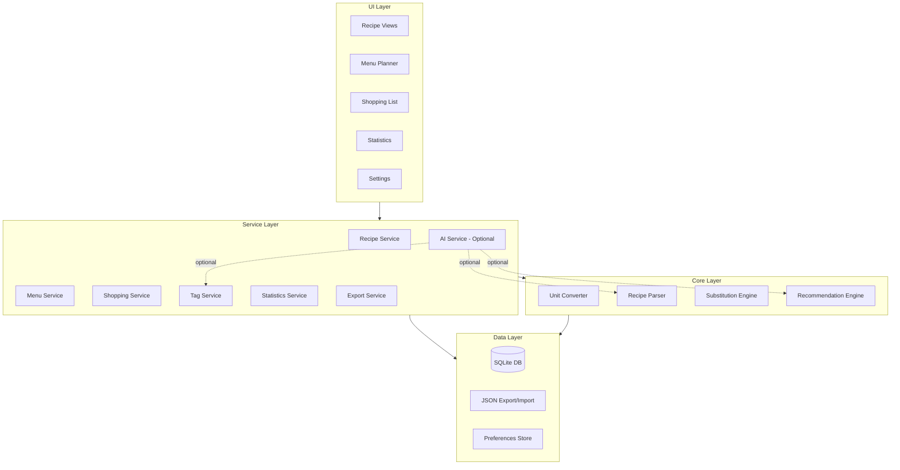

# Design Document: Sous Chef

## Overview

Sous Chef is a local-first recipe and grocery management application built for home cooks who want complete control over their culinary data. The app prioritizes offline functionality, user privacy, and flexibility while offering optional AI enhancements for users who want them.

The architecture follows a layered approach with SQLite as the persistence layer, a service layer for business logic, and a modular UI that can adapt to different platforms. AI features are implemented as optional plugins that can be enabled with either cloud APIs or local models.

## Architecture



### Key Architectural Decisions

1. **Local-First with SQLite**: All data lives locally in SQLite with WAL mode for performance. The cloud is never required.

2. **AI as Plugin**: AI features are isolated behind an abstraction layer. The app works fully without AI; AI enhances but never gates functionality.

3. **JSON for Portability**: While SQLite handles storage, JSON is the interchange format for sharing, backup, and import/export.

4. **Versioned Data**: Recipes use append-only versioning - edits create new versions, nothing is truly deleted.

## Components and Interfaces

### Recipe Service

```typescript
interface RecipeService {
  // CRUD operations
  createRecipe(recipe: RecipeInput): Promise<Recipe>;
  getRecipe(id: string, version?: number): Promise<Recipe>;
  updateRecipe(id: string, updates: RecipeInput): Promise<Recipe>;
  archiveRecipe(id: string): Promise<void>;
  restoreRecipe(id: string, version: number): Promise<Recipe>;
  
  // Versioning
  getVersionHistory(id: string): Promise<RecipeVersion[]>;
  
  // Duplication and Heritage
  duplicateRecipe(id: string): Promise<Recipe>;
  getRecipeHeritage(id: string): Promise<RecipeHeritage>;
  
  // Search
  searchRecipes(query: SearchQuery): Promise<Recipe[]>;
  
  // Import
  importFromUrl(url: string): Promise<ParsedRecipe>;
  importFromJson(data: RecipeExport): Promise<Recipe[]>;
  
  // Folders
  createFolder(name: string): Promise<Folder>;
  moveToFolder(recipeId: string, folderId: string): Promise<void>;
  getFolderContents(folderId: string): Promise<Recipe[]>;
}

interface Recipe {
  id: string;
  version: number;
  title: string;
  description?: string;
  ingredients: Ingredient[];
  instructions: Instruction[];
  prepTime: Duration;
  cookTime: Duration;
  servings: number;
  tags: string[];
  rating?: number;
  sourceUrl?: string;
  folderId?: string;
  parentRecipeId?: string;  // For duplicated recipes
  createdAt: Date;
  updatedAt: Date;
  archivedAt?: Date;
}

interface RecipeHeritage {
  recipe: Recipe;
  parent?: Recipe;
  ancestors: Recipe[];  // Full lineage back to original
  children: Recipe[];   // Recipes duplicated from this one
}

interface Ingredient {
  name: string;
  quantity: number;
  unit: Unit;
  notes?: string;
  category?: IngredientCategory;
}

interface Instruction {
  step: number;
  text: string;
  duration?: Duration;
  notes?: string;
}
```

### Unit Converter

```typescript
interface UnitConverter {
  // Scaling
  scaleRecipe(recipe: Recipe, factor: number): Recipe;
  scaleIngredient(ingredient: Ingredient, factor: number): Ingredient;
  
  // Conversion
  convert(quantity: number, fromUnit: Unit, toUnit: Unit): number;
  convertToSystem(ingredient: Ingredient, system: UnitSystem): Ingredient;
  
  // Smart rounding
  roundToPractical(quantity: number, unit: Unit): number;
}

type UnitSystem = 'us' | 'metric';

type Unit = 
  // Volume (US)
  | 'tsp' | 'tbsp' | 'cup' | 'fl_oz' | 'pint' | 'quart' | 'gallon'
  // Volume (Metric)
  | 'ml' | 'l'
  // Weight (US)
  | 'oz' | 'lb'
  // Weight (Metric)
  | 'g' | 'kg'
  // Count
  | 'piece' | 'dozen'
  // Other
  | 'pinch' | 'dash' | 'to_taste';
```

### Recipe Parser

```typescript
interface RecipeParser {
  // Parse from URL - tries schema.org first, falls back to AI if enabled
  parseFromUrl(url: string, options?: ParseOptions): Promise<ParseResult>;
  
  // Parse from HTML directly
  parseFromHtml(html: string, options?: ParseOptions): Promise<ParseResult>;
  
  // Extract schema.org structured data
  extractSchemaOrg(html: string): SchemaOrgRecipe | null;
}

interface ParseOptions {
  useAI?: boolean;  // Only used if AI is configured
}

interface ParseResult {
  success: boolean;
  recipe?: ParsedRecipe;
  confidence: number;  // 0-1, how confident the parser is
  source: 'schema.org' | 'ai' | 'manual';
  errors?: string[];
}

interface ParsedRecipe {
  title: string;
  description?: string;
  ingredients: string[];  // Raw strings, need normalization
  instructions: string[];
  prepTime?: string;
  cookTime?: string;
  servings?: number;
  imageUrl?: string;
  sourceUrl: string;
}
```

### Menu Planner Service

```typescript
interface MenuService {
  // Menu CRUD
  createMenu(name: string, dateRange: DateRange): Promise<Menu>;
  getMenu(id: string): Promise<Menu>;
  updateMenu(id: string, updates: MenuUpdate): Promise<Menu>;
  deleteMenu(id: string): Promise<void>;
  
  // Assignments
  assignRecipe(menuId: string, assignment: MenuAssignment): Promise<void>;
  removeAssignment(menuId: string, assignmentId: string): Promise<void>;
  moveAssignment(menuId: string, assignmentId: string, newSlot: MealSlot): Promise<void>;
  
  // Leftovers
  calculateLeftoverDate(recipe: Recipe, cookDate: Date): Date;
  
  // Meal Prep
  generateMealPrepPlan(menuId: string): Promise<MealPrepPlan>;
}

interface Menu {
  id: string;
  name: string;
  startDate: Date;
  endDate: Date;
  assignments: MenuAssignment[];
  createdAt: Date;
}

interface MenuAssignment {
  id: string;
  recipeId: string;
  date: Date;
  mealSlot: MealSlot;
  servings: number;
  cookDate: Date;
  leftoverExpiryDate: Date;
}

type MealSlot = 'breakfast' | 'lunch' | 'dinner' | 'snack';

interface MealPrepPlan {
  tasks: PrepTask[];
  totalTime: Duration;
  sharedIngredients: SharedIngredient[];
}

interface PrepTask {
  id: string;
  description: string;
  recipeIds: string[];  // Which recipes this task serves
  duration: Duration;
  order: number;
  completed: boolean;
}
```

### Shopping List Service

```typescript
interface ShoppingService {
  // Generation
  generateFromMenu(menuId: string): Promise<ShoppingList>;
  generateFromRecipes(recipeIds: string[], servings?: Map<string, number>): Promise<ShoppingList>;
  
  // Management
  getList(id: string): Promise<ShoppingList>;
  checkItem(listId: string, itemId: string): Promise<void>;
  uncheckItem(listId: string, itemId: string): Promise<void>;
  addCustomItem(listId: string, item: CustomItem): Promise<void>;
  
  // Export
  exportToText(listId: string): string;
}

interface ShoppingList {
  id: string;
  menuId?: string;
  items: ShoppingItem[];
  createdAt: Date;
}

interface ShoppingItem {
  id: string;
  name: string;
  quantity: number;
  unit: Unit;
  category: IngredientCategory;
  checked: boolean;
  recipeIds: string[];  // Which recipes need this
  cookByDate?: Date;    // Earliest cook date for freshness
}

type IngredientCategory = 
  | 'produce' | 'meat' | 'seafood' | 'dairy' | 'bakery'
  | 'frozen' | 'pantry' | 'spices' | 'beverages' | 'other';
```

### Tag Service

```typescript
interface TagService {
  // Manual tagging
  addTag(recipeId: string, tag: string): Promise<void>;
  removeTag(recipeId: string, tag: string): Promise<void>;
  
  // Auto-tagging (requires AI)
  suggestTags(recipe: Recipe): Promise<TagSuggestion[]>;
  
  // Search
  getRecipesByTag(tag: string): Promise<Recipe[]>;
  getAllTags(): Promise<TagCount[]>;
  
  // Dietary detection
  detectDietaryTags(ingredients: Ingredient[]): DietaryTag[];
}

interface TagSuggestion {
  tag: string;
  confidence: number;
  reason: string;
}

type DietaryTag = 
  | 'vegan' | 'vegetarian' | 'gluten-free' 
  | 'dairy-free' | 'nut-free' | 'low-carb';
```

### Statistics Service

```typescript
interface StatsService {
  // Cook sessions
  logCookSession(session: CookSession): Promise<void>;
  getCookStats(recipeId: string): Promise<CookStats>;
  
  // Ratings
  rateRecipe(recipeId: string, rating: number): Promise<void>;
  getRatingHistory(recipeId: string): Promise<RatingEntry[]>;
  
  // Personal stats
  getPersonalStats(period?: DateRange): Promise<PersonalStats>;
  getYearInReview(year: number): Promise<YearInReview>;
  
  // Usage tracking
  trackFeatureUsage(feature: string): Promise<void>;
}

interface CookSession {
  recipeId: string;
  date: Date;
  actualPrepTime?: Duration;
  actualCookTime?: Duration;
  servingsMade: number;
  notes?: string;
}

interface CookStats {
  timesCoooked: number;
  lastCooked?: Date;
  avgPrepTime?: Duration;
  avgCookTime?: Duration;
  minPrepTime?: Duration;
  maxPrepTime?: Duration;
  minCookTime?: Duration;
  maxCookTime?: Duration;
}

interface PersonalStats {
  totalRecipes: number;
  totalCookSessions: number;
  mostCookedRecipes: RecipeCount[];
  favoriteCuisines: TagCount[];
  favoriteCategories: TagCount[];
  avgCooksPerWeek: number;
}

interface YearInReview {
  year: number;
  totalCookSessions: number;
  uniqueRecipes: number;
  newRecipesAdded: number;
  topRecipes: RecipeCount[];
  topTags: TagCount[];
  monthlyActivity: MonthlyStats[];
  longestStreak: number;
  totalTimeSpentCooking: Duration;
}
```

### Recommendation Engine

```typescript
interface RecommendationEngine {
  // Rule-based (always available)
  getFavorites(limit?: number): Promise<Recipe[]>;
  getDeepCuts(limit?: number): Promise<Recipe[]>;
  getRecentlyAdded(limit?: number): Promise<Recipe[]>;
  getNotCookedRecently(limit?: number): Promise<Recipe[]>;
  
  // Filtered recommendations
  getRecommendations(filters: RecommendationFilters): Promise<Recipe[]>;
  
  // AI-enhanced (when enabled)
  getAIRecommendations(prompt: string): Promise<Recipe[]>;
}

interface RecommendationFilters {
  maxPrepTime?: Duration;
  maxCookTime?: Duration;
  tags?: string[];
  excludeTags?: string[];
  minRating?: number;
  servings?: number;
  ingredients?: string[];  // "What can I make with..."
}
```

### AI Service

```typescript
interface AIService {
  // Configuration
  isEnabled(): boolean;
  configure(config: AIConfig): Promise<void>;
  
  // Capabilities
  parseRecipe(html: string): Promise<ParsedRecipe>;
  suggestTags(recipe: Recipe): Promise<TagSuggestion[]>;
  suggestSubstitutions(ingredient: Ingredient): Promise<Substitution[]>;
  chat(message: string, context: ChatContext): Promise<string>;
}

interface AIConfig {
  provider: 'openai' | 'anthropic' | 'ollama' | 'custom';
  apiKey?: string;  // For cloud providers
  endpoint?: string;  // For local/custom
  model?: string;
}

interface ChatContext {
  recipes: Recipe[];
  currentMenu?: Menu;
  preferences: UserPreferences;
}
```

### Export Service

```typescript
interface ExportService {
  // PDF export
  exportRecipeToPdf(recipeId: string, options?: PdfExportOptions): Promise<Blob>;
  exportMenuToPdf(menuId: string): Promise<Blob>;
  
  // JSON export (for app sharing)
  exportRecipe(recipeId: string, includePhotos?: boolean): Promise<RecipeExport>;
  exportFolder(folderId: string, includePhotos?: boolean): Promise<FolderExport>;
  exportAll(): Promise<FullExport>;
  
  // Import
  importRecipes(data: RecipeExport | FolderExport | FullExport): Promise<ImportResult>;
}

interface PdfExportOptions {
  includePhotos?: boolean;
  includeNutrition?: boolean;
  includeHistory?: boolean;
}

interface RecipeExport {
  version: string;  // Schema version
  exportedAt: Date;
  recipes: Recipe[];
  photos?: PhotoExport[];
  cookSessions?: CookSession[];
  ratings?: RatingEntry[];
}

interface FolderExport extends RecipeExport {
  folder: Folder;
}
```

### Photo Manager

```typescript
interface PhotoManager {
  // Photo CRUD
  addPhoto(recipeId: string, photo: PhotoInput): Promise<Photo>;
  getPhotos(recipeId: string): Promise<Photo[]>;
  getPhotosByInstance(instanceId: string): Promise<Photo[]>;
  deletePhoto(photoId: string): Promise<void>;
  
  // Photo metadata
  updatePhotoMetadata(photoId: string, metadata: PhotoMetadata): Promise<void>;
  
  // Navigation
  getInstanceFromPhoto(photoId: string): Promise<RecipeInstance>;
}

interface Photo {
  id: string;
  recipeId: string;
  instanceId?: string;  // Links to specific cook session
  filename: string;
  mimeType: string;  // image/jpeg, image/png, image/heic, image/heif
  width: number;
  height: number;
  takenAt?: Date;
  metadata: PhotoMetadata;
  createdAt: Date;
}

interface PhotoMetadata {
  caption?: string;
  step?: number;  // Which instruction step this photo relates to
  tags?: string[];
}

interface PhotoInput {
  data: Blob | ArrayBuffer;
  filename: string;
  instanceId?: string;
  metadata?: PhotoMetadata;
}

type SupportedImageFormat = 'image/jpeg' | 'image/png' | 'image/heic' | 'image/heif' | 'image/tiff';
```

### Recipe Instance Service

```typescript
interface RecipeInstanceService {
  // Instance management
  createInstance(recipeId: string, config: InstanceConfig): Promise<RecipeInstance>;
  getInstance(instanceId: string): Promise<RecipeInstance>;
  getInstancesForRecipe(recipeId: string): Promise<RecipeInstance[]>;
  
  // Load instance configuration
  loadInstanceAsRecipe(instanceId: string): Promise<Recipe>;  // Returns recipe with instance's config applied
}

interface RecipeInstance {
  id: string;
  recipeId: string;
  recipeVersion: number;  // Which version was used
  cookSessionId?: string;  // Links to cook session if logged
  
  // Configuration snapshot
  scaleFactor: number;
  unitSystem: UnitSystem;
  servings: number;
  notes?: string;
  modifications?: IngredientModification[];
  
  // Photos taken during this cook
  photoIds: string[];
  
  createdAt: Date;
}

interface InstanceConfig {
  scaleFactor?: number;
  unitSystem?: UnitSystem;
  servings?: number;
  notes?: string;
  modifications?: IngredientModification[];
}

interface IngredientModification {
  ingredientIndex: number;
  originalQuantity: number;
  modifiedQuantity: number;
  note?: string;
}
```

### Visual Parser

```typescript
interface VisualParser {
  // Check availability
  isAvailable(): boolean;  // Returns false if AI not configured
  
  // Parse from image
  parseFromImage(image: Blob | ArrayBuffer, options?: VisualParseOptions): Promise<VisualParseResult>;
  
  // Supported formats
  getSupportedFormats(): SupportedImageFormat[];
}

interface VisualParseOptions {
  language?: string;  // Hint for handwritten text
  recipeType?: string;  // Hint: 'handwritten', 'printed', 'screenshot'
}

interface VisualParseResult {
  success: boolean;
  recipe?: ParsedRecipe;
  confidence: number;  // 0-1 overall confidence
  fieldConfidence: FieldConfidence;  // Per-field confidence
  warnings?: string[];  // Low-confidence fields highlighted
  rawText?: string;  // Extracted text for debugging
}

interface FieldConfidence {
  title: number;
  ingredients: number;
  instructions: number;
  prepTime: number;
  cookTime: number;
  servings: number;
}
```

## Data Models

### SQLite Schema

```sql
-- Core tables
CREATE TABLE recipes (
  id TEXT PRIMARY KEY,
  current_version INTEGER NOT NULL DEFAULT 1,
  folder_id TEXT REFERENCES folders(id),
  parent_recipe_id TEXT REFERENCES recipes(id),  -- For duplicated recipes
  archived_at DATETIME,
  created_at DATETIME NOT NULL DEFAULT CURRENT_TIMESTAMP
);

CREATE TABLE recipe_versions (
  id TEXT PRIMARY KEY,
  recipe_id TEXT NOT NULL REFERENCES recipes(id),
  version INTEGER NOT NULL,
  title TEXT NOT NULL,
  description TEXT,
  prep_time_minutes INTEGER,
  cook_time_minutes INTEGER,
  servings INTEGER NOT NULL DEFAULT 4,
  source_url TEXT,
  created_at DATETIME NOT NULL DEFAULT CURRENT_TIMESTAMP,
  UNIQUE(recipe_id, version)
);

CREATE TABLE ingredients (
  id TEXT PRIMARY KEY,
  recipe_version_id TEXT NOT NULL REFERENCES recipe_versions(id),
  name TEXT NOT NULL,
  quantity REAL,
  unit TEXT,
  notes TEXT,
  category TEXT,
  sort_order INTEGER NOT NULL
);

CREATE TABLE instructions (
  id TEXT PRIMARY KEY,
  recipe_version_id TEXT NOT NULL REFERENCES recipe_versions(id),
  step_number INTEGER NOT NULL,
  text TEXT NOT NULL,
  duration_minutes INTEGER,
  notes TEXT
);

-- Photos
CREATE TABLE photos (
  id TEXT PRIMARY KEY,
  recipe_id TEXT NOT NULL REFERENCES recipes(id),
  instance_id TEXT REFERENCES recipe_instances(id),
  filename TEXT NOT NULL,
  mime_type TEXT NOT NULL,
  width INTEGER,
  height INTEGER,
  file_path TEXT NOT NULL,  -- Local path to image file
  taken_at DATETIME,
  caption TEXT,
  step_number INTEGER,  -- Which instruction step
  created_at DATETIME NOT NULL DEFAULT CURRENT_TIMESTAMP
);

-- Recipe Instances (cook session configurations)
CREATE TABLE recipe_instances (
  id TEXT PRIMARY KEY,
  recipe_id TEXT NOT NULL REFERENCES recipes(id),
  recipe_version INTEGER NOT NULL,
  cook_session_id TEXT REFERENCES cook_sessions(id),
  scale_factor REAL NOT NULL DEFAULT 1.0,
  unit_system TEXT NOT NULL DEFAULT 'us',
  servings INTEGER NOT NULL,
  notes TEXT,
  created_at DATETIME NOT NULL DEFAULT CURRENT_TIMESTAMP
);

CREATE TABLE instance_modifications (
  id TEXT PRIMARY KEY,
  instance_id TEXT NOT NULL REFERENCES recipe_instances(id),
  ingredient_index INTEGER NOT NULL,
  original_quantity REAL,
  modified_quantity REAL,
  note TEXT
);

-- Tagging
CREATE TABLE tags (
  id TEXT PRIMARY KEY,
  name TEXT NOT NULL UNIQUE
);

CREATE TABLE recipe_tags (
  recipe_id TEXT NOT NULL REFERENCES recipes(id),
  tag_id TEXT NOT NULL REFERENCES tags(id),
  PRIMARY KEY (recipe_id, tag_id)
);

-- Organization
CREATE TABLE folders (
  id TEXT PRIMARY KEY,
  name TEXT NOT NULL,
  parent_id TEXT REFERENCES folders(id),
  created_at DATETIME NOT NULL DEFAULT CURRENT_TIMESTAMP
);

-- Menu planning
CREATE TABLE menus (
  id TEXT PRIMARY KEY,
  name TEXT NOT NULL,
  start_date DATE NOT NULL,
  end_date DATE NOT NULL,
  created_at DATETIME NOT NULL DEFAULT CURRENT_TIMESTAMP
);

CREATE TABLE menu_assignments (
  id TEXT PRIMARY KEY,
  menu_id TEXT NOT NULL REFERENCES menus(id),
  recipe_id TEXT NOT NULL REFERENCES recipes(id),
  date DATE NOT NULL,
  meal_slot TEXT NOT NULL,
  servings INTEGER NOT NULL DEFAULT 4,
  cook_date DATE NOT NULL,
  leftover_expiry_date DATE
);

-- Shopping
CREATE TABLE shopping_lists (
  id TEXT PRIMARY KEY,
  menu_id TEXT REFERENCES menus(id),
  created_at DATETIME NOT NULL DEFAULT CURRENT_TIMESTAMP
);

CREATE TABLE shopping_items (
  id TEXT PRIMARY KEY,
  list_id TEXT NOT NULL REFERENCES shopping_lists(id),
  name TEXT NOT NULL,
  quantity REAL,
  unit TEXT,
  category TEXT,
  checked INTEGER NOT NULL DEFAULT 0,
  cook_by_date DATE
);

-- Statistics
CREATE TABLE cook_sessions (
  id TEXT PRIMARY KEY,
  recipe_id TEXT NOT NULL REFERENCES recipes(id),
  instance_id TEXT REFERENCES recipe_instances(id),
  date DATETIME NOT NULL,
  actual_prep_minutes INTEGER,
  actual_cook_minutes INTEGER,
  servings_made INTEGER,
  notes TEXT
);

CREATE TABLE ratings (
  id TEXT PRIMARY KEY,
  recipe_id TEXT NOT NULL REFERENCES recipes(id),
  rating INTEGER NOT NULL CHECK (rating >= 1 AND rating <= 5),
  rated_at DATETIME NOT NULL DEFAULT CURRENT_TIMESTAMP
);

-- Preferences
CREATE TABLE preferences (
  key TEXT PRIMARY KEY,
  value TEXT NOT NULL
);

-- AI Configuration (stored separately for security)
CREATE TABLE ai_config (
  key TEXT PRIMARY KEY,
  value TEXT NOT NULL  -- Encrypted
);

-- Indexes for performance
CREATE INDEX idx_recipe_versions_recipe ON recipe_versions(recipe_id);
CREATE INDEX idx_ingredients_version ON ingredients(recipe_version_id);
CREATE INDEX idx_instructions_version ON instructions(recipe_version_id);
CREATE INDEX idx_recipe_tags_recipe ON recipe_tags(recipe_id);
CREATE INDEX idx_recipe_tags_tag ON recipe_tags(tag_id);
CREATE INDEX idx_menu_assignments_menu ON menu_assignments(menu_id);
CREATE INDEX idx_menu_assignments_date ON menu_assignments(date);
CREATE INDEX idx_cook_sessions_recipe ON cook_sessions(recipe_id);
CREATE INDEX idx_cook_sessions_date ON cook_sessions(date);
CREATE INDEX idx_ratings_recipe ON ratings(recipe_id);
CREATE INDEX idx_photos_recipe ON photos(recipe_id);
CREATE INDEX idx_photos_instance ON photos(instance_id);
CREATE INDEX idx_recipe_instances_recipe ON recipe_instances(recipe_id);
CREATE INDEX idx_recipes_parent ON recipes(parent_recipe_id);

-- Full-text search
CREATE VIRTUAL TABLE recipes_fts USING fts5(
  title,
  description,
  content='recipe_versions',
  content_rowid='rowid'
);
```

### JSON Export Format

```json
{
  "version": "1.0",
  "exportedAt": "2026-01-25T12:00:00Z",
  "recipes": [
    {
      "id": "uuid",
      "title": "Spaghetti Carbonara",
      "description": "Classic Roman pasta dish",
      "ingredients": [
        {
          "name": "spaghetti",
          "quantity": 400,
          "unit": "g",
          "category": "pantry"
        }
      ],
      "instructions": [
        {
          "step": 1,
          "text": "Bring a large pot of salted water to boil"
        }
      ],
      "prepTime": "PT15M",
      "cookTime": "PT20M",
      "servings": 4,
      "tags": ["italian", "pasta", "quick"],
      "sourceUrl": "https://example.com/carbonara"
    }
  ],
  "cookSessions": [],
  "ratings": []
}
```


## Correctness Properties

*A property is a characteristic or behavior that should hold true across all valid executions of a system—essentially, a formal statement about what the system should do. Properties serve as the bridge between human-readable specifications and machine-verifiable correctness guarantees.*


### Property 1: Recipe Data Round-Trip Persistence

*For any* valid recipe with all fields populated (title, ingredients, instructions, prep time, cook time, servings), storing the recipe and then retrieving it SHALL return an equivalent recipe with all fields preserved.

**Validates: Requirements 1.1, 9.4**

### Property 2: Recipe Versioning Preserves History

*For any* recipe and any sequence of edits, each edit SHALL create a new version, and all previous versions SHALL remain retrievable. The version count SHALL equal the number of edits plus one (for the original).

**Validates: Requirements 1.2, 1.3**

### Property 3: Soft Delete Preserves Data

*For any* recipe that is deleted, the recipe SHALL still exist in storage with an archived flag set, and SHALL be restorable.

**Validates: Requirements 1.4**

### Property 4: Scaling Multiplies All Quantities

*For any* recipe and any positive scale factor, scaling the recipe SHALL multiply each ingredient quantity by exactly that factor. Mathematically: `scaled_quantity = original_quantity * factor` for all ingredients.

**Validates: Requirements 2.1**

### Property 5: Unit Conversion Round-Trip

*For any* ingredient with a convertible unit, converting from US to metric and back to US (or vice versa) SHALL produce a value within 1% of the original quantity.

**Validates: Requirements 2.2**

### Property 6: Unit Preference Consistency

*For any* recipe and any unit system preference (US or metric), all displayed measurements SHALL be in the preferred unit system.

**Validates: Requirements 2.3, 10.1**

### Property 7: Practical Rounding Produces Valid Measurements

*For any* scaled quantity, the rounded result SHALL be a practical cooking measurement (e.g., 1/4, 1/3, 1/2, 2/3, 3/4, or whole numbers for common units).

**Validates: Requirements 2.4**

### Property 8: Tag Association Completeness

*For any* recipe and any tag added to it, searching by that tag SHALL return that recipe in the results.

**Validates: Requirements 3.1, 3.4**

### Property 9: Text Search Coverage

*For any* recipe and any substring that appears in its title, ingredients, instructions, or tags, searching for that substring SHALL return that recipe in the results.

**Validates: Requirements 3.5**

### Property 10: Leftover Date Calculation

*For any* recipe added to a menu with a cook date, the leftover expiration date SHALL equal the cook date plus the recipe's configured leftover duration (or the default duration if not configured).

**Validates: Requirements 4.3, 4.4, 10.3**

### Property 11: Menu Date Range Support

*For any* valid date range (start date before or equal to end date), a menu SHALL be creatable and SHALL accept recipe assignments for any date within that range.

**Validates: Requirements 4.5**

### Property 12: Shopping List Ingredient Consolidation

*For any* set of recipes, generating a shopping list SHALL include every unique ingredient from all recipes, and ingredients with the same name and compatible units SHALL be combined with their quantities summed.

**Validates: Requirements 5.1, 5.2**

### Property 13: Shopping List Category Organization

*For any* shopping list, all items SHALL be assigned to exactly one category, and items SHALL be grouped by category when displayed.

**Validates: Requirements 5.4**

### Property 14: Shopping Item Check State

*For any* shopping list item, checking it SHALL set its checked state to true, and unchecking it SHALL set its checked state to false.

**Validates: Requirements 5.3**

### Property 15: Meal Prep Ingredient Consolidation

*For any* set of recipes with overlapping ingredients, meal prep mode SHALL group preparation tasks for those shared ingredients into single tasks.

**Validates: Requirements 6.1, 6.2**

### Property 16: Prep Task Completion State

*For any* prep task, marking it complete SHALL update its state and SHALL not affect other tasks' completion states.

**Validates: Requirements 6.4**

### Property 17: Recipe Suggestion by Ingredients

*For any* set of available ingredients, suggested recipes SHALL be makeable with those ingredients (possibly with some missing), and SHALL be ordered by the number of missing ingredients (ascending).

**Validates: Requirements 7.2, 7.4**

### Property 18: Export/Import Round-Trip

*For any* recipe (or set of recipes), exporting to JSON and then importing SHALL produce equivalent recipes with all data preserved.

**Validates: Requirements 8.3, 9.9**

### Property 19: Folder Export Completeness

*For any* folder containing recipes, exporting the folder SHALL include all recipes in that folder in the export.

**Validates: Requirements 8.4, 9.8**

### Property 20: Preference Persistence

*For any* user preference that is set, the preference SHALL persist across application restarts and SHALL be retrievable with the same value.

**Validates: Requirements 10.4**

### Property 21: Cook Session Recording

*For any* cook session logged with prep time and cook time, the session SHALL be stored and retrievable, and SHALL be associated with the correct recipe.

**Validates: Requirements 12.1**

### Property 22: Cook Time Statistics Calculation

*For any* recipe with N cook sessions (N > 0), the statistics SHALL correctly calculate: average = sum/N, minimum = smallest value, maximum = largest value, and times cooked = N.

**Validates: Requirements 12.2, 12.4**

### Property 23: Menu Time Estimation Fallback

*For any* recipe in a menu, the time estimate SHALL use the statistical average if cook sessions exist, otherwise SHALL use the recipe's stated estimate.

**Validates: Requirements 12.5**

### Property 24: Rating Storage and Retrieval

*For any* recipe and any rating value (1-5), storing the rating SHALL persist it, and the rating SHALL be retrievable and equal to the stored value.

**Validates: Requirements 13.1**

### Property 25: Rating Filter and Sort

*For any* minimum rating filter, searching with that filter SHALL return only recipes with ratings greater than or equal to the filter value. Sorting by rating SHALL order recipes by rating value.

**Validates: Requirements 13.3**

### Property 26: Rating History Tracking

*For any* recipe that is rated multiple times, all ratings SHALL be stored with timestamps, and the history SHALL be retrievable in chronological order.

**Validates: Requirements 13.5**

### Property 27: Favorites Recommendation

*For any* request for favorites, the returned recipes SHALL have high ratings (≥4 stars) AND high cook frequency (above median), sorted by a combination of both factors.

**Validates: Requirements 13.4, 15.2**

### Property 28: Deep Cuts Recommendation

*For any* request for deep cuts, the returned recipes SHALL have good ratings (≥3 stars) AND low cook frequency (below median or never cooked), sorted by rating.

**Validates: Requirements 15.3**

### Property 29: Statistics Tracking Completeness

*For any* set of cook sessions, the personal statistics SHALL correctly report: total cook sessions, unique recipes cooked, most-cooked recipes (sorted by frequency), and most-used tags (sorted by frequency).

**Validates: Requirements 14.1, 14.2, 14.4, 14.6**

### Property 30: Year in Review Accuracy

*For any* year with cook sessions, the year in review SHALL include only sessions from that year, and all calculated statistics SHALL be accurate for that year's data.

**Validates: Requirements 14.3**

### Property 31: Recipe Duplication Preserves Heritage

*For any* recipe that is duplicated, the new recipe SHALL have a reference to the parent recipe, and the heritage chain SHALL be traversable back to the original recipe.

**Validates: Requirements 1.10, 1.11**

### Property 32: Photo-Instance Association

*For any* photo added during a cook session, the photo SHALL be associated with the correct recipe instance, and navigating from the photo SHALL return the exact configuration (scale, units, notes) used.

**Validates: Requirements 17.2, 17.3, 18.4**

### Property 33: Recipe Instance Configuration Snapshot

*For any* recipe instance, loading it SHALL return the recipe with the exact scale factor, unit system, and servings that were used, producing the same ingredient quantities as when originally cooked.

**Validates: Requirements 18.2, 18.3, 18.6**

### Property 34: Photo Format Support

*For any* photo in a supported format (JPEG, PNG, HEIC, HEIF), the Photo_Manager SHALL successfully store and retrieve the photo with correct metadata.

**Validates: Requirements 17.4**

### Property 35: Multiple Photos Per Recipe

*For any* recipe, adding N photos SHALL result in exactly N photos being retrievable for that recipe, organized by cook session.

**Validates: Requirements 17.1, 17.5**

### Property 36: Visual Parse Confidence Reporting

*For any* image parsed by the Visual_Parser, the result SHALL include per-field confidence scores, and fields with confidence below threshold SHALL be flagged in warnings.

**Validates: Requirements 19.4, 19.5**

## Error Handling

### Recipe Parser Errors

| Error Condition | Handling |
|----------------|----------|
| URL unreachable | Return error with message, offer manual entry |
| No schema.org data found | If AI enabled, attempt AI extraction; otherwise return error |
| AI extraction fails | Return error with partial data if available, offer manual entry |
| Invalid recipe data | Return validation errors, allow user to fix |

### Unit Conversion Errors

| Error Condition | Handling |
|----------------|----------|
| Incompatible units (e.g., cups to grams without density) | Keep original unit, flag for user attention |
| Unknown unit | Keep as-is, log warning |
| Overflow/underflow | Cap at reasonable bounds, warn user |

### Data Persistence Errors

| Error Condition | Handling |
|----------------|----------|
| SQLite write failure | Retry with exponential backoff, then alert user |
| Corrupt database | Attempt recovery, offer restore from backup |
| Import parse failure | Return detailed error with line/field information |
| Export failure | Return error, suggest retry or alternative format |

### AI Service Errors

| Error Condition | Handling |
|----------------|----------|
| API key invalid | Prompt user to reconfigure |
| Rate limited | Queue request, retry with backoff |
| Model unavailable | Fall back to non-AI functionality |
| Timeout | Return partial results if available, offer retry |

### Photo Manager Errors

| Error Condition | Handling |
|----------------|----------|
| Unsupported format | Return error with list of supported formats |
| File too large | Return error with size limit, suggest compression |
| Corrupt image | Return error, offer to skip or retry |
| Storage full | Alert user, suggest cleanup or export |

### Visual Parser Errors

| Error Condition | Handling |
|----------------|----------|
| AI not configured | Return error indicating AI required |
| Image unreadable | Return error, suggest better quality image |
| No recipe detected | Return error, offer manual entry |
| Low confidence extraction | Return result with warnings, highlight uncertain fields |

## Testing Strategy

### Test Infrastructure

**Directory Structure**:
```
tests/
├── unit/                    # Unit tests for individual functions/classes
│   ├── services/
│   ├── core/
│   └── utils/
├── integration/             # Tests spanning multiple components
├── e2e/                     # End-to-end workflow tests
├── fixtures/                # Test data and mocks
│   ├── recipes/             # Sample recipe JSON files
│   ├── menus/               # Sample menu configurations
│   ├── images/              # Test images (various formats)
│   └── snapshots/           # State snapshots for crash reproduction
├── mocks/                   # Mock implementations
│   ├── ai-service.mock.ts   # Mock AI responses
│   ├── database.mock.ts     # In-memory SQLite for tests
│   └── photo-manager.mock.ts
└── generators/              # Property-based test generators
```

**Mock Strategy**:
- AI Service: Pre-recorded responses for deterministic testing
- Database: In-memory SQLite with seeded data
- File System: Virtual file system for photo tests
- Network: Recorded HTTP responses for URL parsing tests

**Fixture Library**:
- 50+ sample recipes covering edge cases (empty, large, unicode, mixed units)
- Menu configurations (single day, week, month, overlapping)
- Shopping lists (simple, consolidated, with cook-by dates)
- Cook sessions with various time ranges and statistics

### Crash Reproduction and Error Logging

**State Capture System**:
```typescript
interface CrashReport {
  id: string;
  timestamp: Date;
  version: string;
  
  // Error details
  error: {
    message: string;
    stack: string;
    code?: string;
  };
  
  // Application state snapshot
  state: {
    currentView: string;
    activeRecipeId?: string;
    activeMenuId?: string;
    pendingOperations: PendingOperation[];
    preferences: UserPreferences;
  };
  
  // Recent actions (last 50)
  actionLog: ActionLogEntry[];
  
  // Database state (optional, for severe crashes)
  databaseSnapshot?: string;  // Path to SQLite backup
}

interface ActionLogEntry {
  timestamp: Date;
  action: string;
  payload: any;
  result: 'success' | 'error';
  duration: number;
}

interface PendingOperation {
  type: string;
  startedAt: Date;
  data: any;
  progress?: number;
}
```

**Logging Levels**:
- `ERROR`: Unrecoverable errors, crashes, data corruption
- `WARN`: Recoverable errors, fallbacks triggered, degraded functionality
- `INFO`: User actions, state transitions, feature usage
- `DEBUG`: Detailed operation traces (disabled in production)

**Error Handling Best Practices**:
1. **Structured Logging**: All logs include context (user action, component, timestamp)
2. **Action Replay**: Log user actions to reproduce issues step-by-step
3. **State Snapshots**: Periodic snapshots of in-progress work (menus, shopping lists)
4. **Graceful Degradation**: Partial failures don't lose user data
5. **Recovery Points**: Auto-save before risky operations

**Crash Report Export**:
```typescript
interface CrashReportService {
  // Capture current state on error
  captureState(error: Error): Promise<CrashReport>;
  
  // Export for sharing with support
  exportReport(reportId: string): Promise<Blob>;  // Anonymized JSON
  
  // Import for reproduction
  importReport(data: Blob): Promise<void>;  // Loads state into test environment
  
  // List recent crashes
  getRecentCrashes(limit?: number): Promise<CrashReport[]>;
}
```

**Reproduction Workflow**:
1. User encounters crash → State automatically captured
2. User exports crash report (anonymized, no personal data)
3. Developer imports report into test environment
4. State restored, action log replayed to reproduce issue
5. Fix developed and tested against same state

### Unit Tests

Unit tests verify specific examples and edge cases:

- Recipe CRUD operations with various field combinations
- Unit conversion edge cases (very small/large quantities, unusual units)
- Tag operations (add, remove, search)
- Shopping list generation with overlapping ingredients
- Statistics calculations with known data sets
- Date calculations for leftovers and menus

### Property-Based Tests

Property-based tests verify universal properties across randomly generated inputs. Each property from the Correctness Properties section will be implemented as a property-based test.

**Testing Framework**: Use a property-based testing library appropriate for the implementation language (e.g., fast-check for TypeScript, Hypothesis for Python, QuickCheck for Haskell).

**Configuration**:
- Minimum 100 iterations per property test
- Each test tagged with: `Feature: sous-chef, Property {N}: {property_title}`

**Generator Requirements**:
- Recipe generator: valid titles, 1-50 ingredients, 1-30 instructions, reasonable times
- Ingredient generator: valid names, quantities (0.01-1000), valid units
- Menu generator: valid date ranges, 1-100 assignments
- Rating generator: integers 1-5
- Cook session generator: valid times, dates within reasonable range

### Integration Tests

- Full recipe lifecycle: create → edit → version → archive → restore
- Menu workflow: create menu → add recipes → generate shopping list → meal prep
- Export/import cycle: export → modify external file → import → verify
- Statistics accumulation over multiple cook sessions

### Edge Cases to Cover

- Empty recipes (no ingredients, no instructions)
- Very large recipes (100+ ingredients)
- Unicode in all text fields
- Extreme scale factors (0.01x to 100x)
- Date edge cases (leap years, timezone boundaries)
- Concurrent modifications (if applicable)
- Interrupted operations (crash during save, import, export)
- Corrupt data recovery
- Photo format edge cases (HEIC from various iOS versions)
- Recipe instance with modifications that reference deleted ingredients

### Test Data Management

**Seeding**:
- Development: Rich dataset with 100+ recipes, menus, sessions
- CI/CD: Minimal dataset for fast tests
- Stress: Large dataset (10,000+ recipes) for performance testing

**Anonymization**:
- Crash reports strip personal data (recipe titles → hashes, photos → dimensions only)
- Test fixtures use synthetic data only
- No real user data in version control
